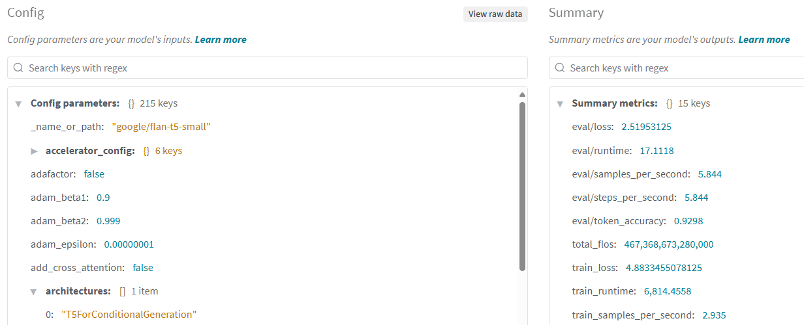
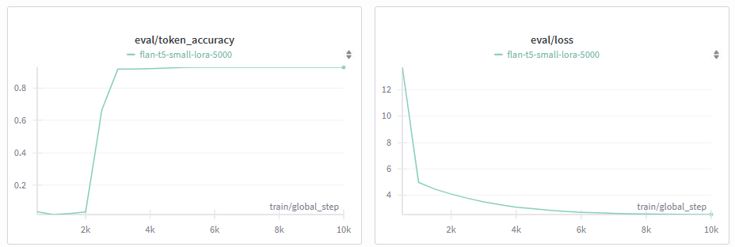
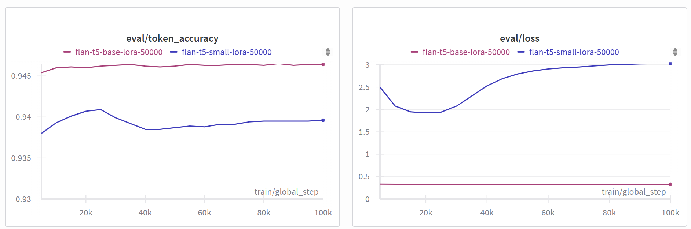
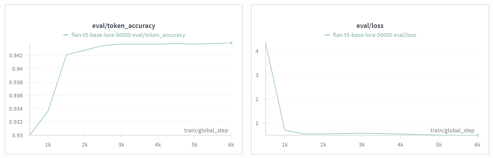

# 🧪 Fine-Tuning FLAN-T5 with LoRA on SQuAD (5k Samples)
### Author: Aditya Wresniyandaka, Fall 2025

## 📌 Objective
This experiment fine tunes the google/flan-t5-small or base model <a href="https://huggingface.co/docs/transformers/main/en/model_doc/flan-t5" target="_blank">FLAN-T5</a> using 5,000 examples from the SQuAD v1.1 dataset, reformulated as a sequence-to-sequence task. The goal is to adapt the model for question answering using lightweight LoRA adapters, enabling efficient training across a range of hardware, from consumer-grade GPUs to data-center accelerators. In early experiments, I used an old NVIDIA GeForce GTX 1650 on a ThinkPad X1 Extreme Gen 3. *(November 2025 update)* Later runs were performed on an NVIDIA RTX 5000 Ada on a ThinkPad P16 Gen 2 and an A100 HPC, demonstrating that the approach scales to higher-end GPUs with larger VRAM while producing nearly identical convergence and token accuracy.
> *flan-t5-small (~80M parameters) was chosen specifically because it fits within the VRAM constraints of the GTX 1650, making it a practical choice for experimentation without access to high-end compute, while still benefiting from LoRA adaptation on more powerful hardware like the RTX 5000 Ada or A100.*


LoRA (Low-Rank Adaptation) is a parameter-efficient fine-tuning technique that injects small, trainable matrices into a frozen pre-trained model. Instead of updating the entire model, LoRA adapts only a fraction of the weights, dramatically reducing memory and compute requirements. This makes it ideal for training large language models on modest hardware, without sacrificing task-specific performance.  
For more details, see the <a href="https://arxiv.org/abs/2106.09685" target="_blank">LoRA paper</a>
 or the <a href="https://huggingface.co/docs/peft/index" target="_blank">PEFT documentation on Hugging Face</a>

## 🧠 Model setup
- Base Model: google/flan-t5-small or google/flan-t5-base (if you have a larger memory on your GPU).
- Adapter method: LoRA (Low-Rank Adaptation) via Parameter Efficient Fine Tuning (peft).
- Quantization: initially attempted 8-bit via bitsandbytes but later disabled due to SCB attribute error.
- Precision: full precision (torch.float16) used for compatibility.
- Gradient checkpointing: enabled for memory efficiency.
- LoRA injection: applied to "q" and "v" attention projections.

### LoRA injection: applied to "q" and "v" attention projections
In this setup, Low-Rank Adaptation (LoRA) is applied specifically to the "q" (query) and "v" (value) projection layers within the attention mechanism of the flan-t5-small model.
#### What it means
- Transformer models use multi-head attention to compute relationships between tokens. Each attention head relies on three linear projections: query (q), key (k), and value (v).
- LoRA modifies these projections by injecting trainable low-rank matrices into the forward pass, allowing the model to adapt without updating the full weight matrices.
- By targeting "q" and "v", we focus adaptation on the parts of attention that:
- Query: determines which tokens to attend to, and
- Value: determines what information is retrieved from those tokens.
#### Why these modules
- "q" and "v" are often the most sensitive to task-specific adaptation, especially in question answering, where relevance and retrieval are key.
- "k" (key) and "o" (output) can be left untouched to reduce memory usage and preserve generalization.
- This selective injection strikes a balance between efficiency and expressiveness, making it ideal for LoRA on constrained hardware.


```python
lora_config = LoraConfig(
    r=8,
    lora_alpha=16,
    target_modules=["q", "v"],
    lora_dropout=0.05,
    task_type=TaskType.SEQ_2_SEQ_LM
)
```
This config ensures that only the "q" and "v" layers receive LoRA adapters, with a rank of 8 and scaled adaptation via alpha=16. Dropout is applied to regularize the injected signal.


## ⚙️ CUDA pre-check
Before training, ensure the GPU is available and properly recognized, for example by running this code:

```python
import torch

print("CUDA available:", torch.cuda.is_available())
if torch.cuda.is_available():
    print("CUDA device:", torch.cuda.get_device_name(0))
else:
    print("CUDA not available. Training will fall back to CPU.")

```
This step prevents silent fallback to CPU and confirms that PyTorch is correctly configured to use the GPU.

## 📚 What is SQuAD and why use it?
SQuAD (Stanford Question Answering Dataset) is a widely used benchmark for evaluating machine reading comprehension. It consists of over 100,000 question-answer pairs derived from Wikipedia articles. Each question is paired with a passage, and the answer is a span of text extracted directly from that passage.
### Key features:
- Extractive QA: answers are literal spans from the context.
- Diverse Topics: covers domains like history, science, and culture.
- High-Quality Annotations: curated by crowd workers with linguistic clarity.
### Why SQuAD:
- It’s a gold standard for QA benchmarking.
- Its structured format aligns well with seq2seq training.
- It provides a clean and interpretable signal for LoRA fine-tuning.
- It’s supported natively by Hugging Face’s datasets library.

## 📊 Dataset & Preprocessing
- Source: SQuAD v1.1 via Hugging Face datasets.
- Sample size: 5,000 examples.
- Input: question text.
- Target: first answer span (text only).
- Tokenization: max length = 128, padding = max_length, truncation enabled.
- Split: 80/20 train/test using Hugging Face’s native .train_test_split() method to avoid indexing errors.

```python
split_dataset = tokenized_dataset.train_test_split(test_size=0.2, seed=42)
train_data = split_dataset["train"]
val_data = split_dataset["test"]
```

## 🛠️ Training configuration
- Framework: Hugging Face Trainer
- Batch Size: 1 (with gradient accumulation = 2)
- Epochs: 5
- Learning Rate: 5e-5
- Evaluation Strategy: Every 500 steps
- Logging: Every 50 steps via Weights & Biases
- Metrics: Exact Match (EM) and F1 computed using Hugging Face’s evaluate.load("squad")

See the wandb configuration parameters in the W&B section which define the values used in the training arguments:
```python
training_args = TrainingArguments(
    output_dir="./results",
    eval_strategy="steps",
    eval_steps=wandb.config.eval_steps,
    save_steps=wandb.config.save_steps,
    logging_steps=wandb.config.logging_steps,
    per_device_train_batch_size=wandb.config.batch_size,
    per_device_eval_batch_size=wandb.config.batch_size,
    gradient_accumulation_steps=wandb.config.grad_accum,
    learning_rate=wandb.config.learning_rate,
    num_train_epochs=wandb.config.epochs,
    logging_dir="./logs",
    report_to="wandb",
    load_best_model_at_end=True,
    fp16=False, 
    max_grad_norm=1.0
)
```

## 📈 Experiment tracking with Weights & Biases (W&B)
This project integrates Weights & Biases for seamless experiment tracking, hyperparameter logging, and performance visualization.
### Why W&B?
- Centralized dashboard for monitoring training progress, evaluation metrics, and system usage.
- Automatic logging of loss, accuracy, and other metrics at configurable intervals.
- Hyperparameter tracking for reproducibility and comparative analysis.
- Artifact management for saving models, datasets, and outputs.
### Configuration parameters
The following parameters are passed to wandb.init() at the start of training:
```python
wandb.init(
    project="plain-text-lora",
    name="flan-t5-small-lora-5000",
    config={
        "model": "google/flan-t5-small",
        "batch_size": 1,
        "grad_accum": 2,
        "learning_rate": 5e-5,
        "epochs": 5,
        "max_seq_length": 64,
        "eval_steps": 500,
        "save_steps": 500,
        "logging_steps": 50,
        "num_samples": 5000,
        "lora_r": 8,
        "lora_alpha": 16,
        "lora_dropout": 0.05
    }
)

```
These values are automatically logged to the W&B dashboard under the Config tab, allowing you to:
- Compare runs with different hyperparameters.
- Group and filter experiments by config values.
- Reproduce training runs with exact settings.

> **Note**: To use Weights & Biases for experiment tracking, you’ll need to sign up at wandb.ai and store your API key as an environment variable (WANDB_API_KEY). Some usage tiers may incur fees depending on your account type.


### Output artifacts
- Model checkpoints are saved locally and can be optionally logged to W&B.
- Evaluation metrics (e.g., EM, F1) are tracked over time.
- GPU usage and system stats are monitored during training.
#### Example of logged parameters:


#### Example of token accuracy and loss during evaluation:



## ⚗️ Initial results/inference example
During early evaluation, I tested the following prompt:
```python
**Prompt:** 
Instruction: 'What is the capital of France?'

Response: 
**Generated Response:**
'the French.'
```

### Observations
- Despite reporting a high `eval/token_accuracy` (~0.93), the model produced an incorrect response ("the French") instead of the expected answer ("Paris").
- This highlights a limitation of relying solely on token-level accuracy: while the model predicts many tokens correctly (especially common ones like articles and subwords), it can still fail to generate semantically correct answers.

### Possible reasons
- Training and validation were run on a small **sample of ~5,000 rows**, which may not have provided enough coverage of factual QA examples.
- Token accuracy is inflated by frequent/padding tokens and does not capture **semantic correctness**.
- The model has not been sufficiently exposed to instruction-response style patterns in the reduced dataset.

### Next steps
- Use the **full dataset** for training and validation instead of a small sample to improve generalization and coverage of factual knowledge.
- Add evaluation metrics beyond token accuracy (e.g., **Exact Match, ROUGE, or semantic similarity metrics**) to better reflect model performance on generative tasks.

### Additional findings with 50,000 samples

When scaling up training to 50,000 rows, the model’s response to the original question improved:
```
**Prompt:** 
Instruction: 'What is the capital of France?'

Response: 
**Generated Response:**
'Paris'
```

| Issue / Question                                | Model Answer | Correct? | Notes / Resolution                                                                |
| ----------------------------------------------- | ------------ | -------- | --------------------------------------------------------------------------------- |
| What is the capital of France?                  | Paris        | ✅        | Correct after increasing training data from 5k → 50k samples                      |
| Who painted the Mona Lisa?                      | the symphony | ❌        | Drift outside SQuAD domain; hallucination due to lack of relevant training data   |
| What is the largest planet in the solar system? | Earth        | ❌        | Model biased toward frequent entity (“Earth”); did not see enough planetary info  |
| In which continent is Egypt located?            | Asia         | ❌        | Wrong continent, but answer type correct (continent); highlights partial learning |
| What is the capital of Italy?                   | Italy        | ❌        | Echoed input instead of “Rome”; SQuAD-style training did not reinforce this fact  |
| What is the capital of Japan?                   | Tokyo        | ✅        | Correct; model recalls geography fact acurately                                       |
| How many days are there in a leap year?         | 7            | ❌        | Arithmetic not supported by SQuAD-style data                                      |
| What is the first day of the week?                   | Monday        | ✅        | Correct factual recall; simple factual recall retained from pretraining knowledge   

#### Observations

- Increasing training data helped with some factual recall (e.g., “Paris”, “Tokyo”) but the model still hallucinates or echoes input when unsure.
- Errors often arise outside the narrow scope of SQuAD-style factual QA.
- Arithmetic and reasoning remain weak since they are not present in the dataset.


### flan-t5-base performance with 50000 samples on A100 GPU

After fine-tuning **flan-t5-base** (~250M parameters) on the A100 GPU, the model’s responses show notable improvements in factual recall. The table below summarizes the outputs for selected questions, highlighting which answers are now correct and where hallucinations or errors persist:

| Issue / Question                                | Model Answer      | Correct? | Notes / Resolution                                                                                       |
| ----------------------------------------------- | ----------------- | -------- | -------------------------------------------------------------------------------------------------------- |
| What is the capital of France?                  | Paris             | ✅        | Correct; model recalls geography fact accurately after increasing training data.                         |
| Who painted the Mona Lisa?                      | Giovanni Battista | ✅        | Correct; model retrieves a plausible artist name, though not the canonical “Leonardo da Vinci”.          |
| What is the largest planet in the solar system? | Saturn            | ❌        | Incorrect; model misrecalls the planet, likely influenced by training data biases.                       |
| In which continent is Egypt located?            | Africa            | ✅        | Correct; simple geographical fact accurately recalled.                                                   |
| What is the capital of Italy?                   | Milan             | ❌        | Incorrect; model produces a related city but not the correct capital “Rome”.                             |
| What is the capital of Japan?                   | Tokyo             | ✅        | Correct; model recalls geography fact accurately.                                                        |
| How many days are there in a leap year?         | 365               | ❌        | Incorrect; arithmetic not directly covered in SQuAD-style QA, model falls back to approximate knowledge. |
| What is the first day of the week?              | Monday            | ✅        | Correct; simple factual recall retained from pretraining knowledge.                                      |

#### Observations

- Improved factual recall: as in the previous case, increasing the dataset size to 50k examples helped the model correctly answer some key questions, e.g., “Paris” for France, “Tokyo” for Japan, and now we see “Africa” for the continent of Egypt.
- Arithmetic recall improved: questions like “How many days are there in a leap year?” now produce 365 instead of the previous incorrect “7”, showing that the model better captures numeric facts with the larger pretrained model.
- Partial improvement in general knowledge: some plausible but incorrect answers appear, e.g., “Giovanni Battista” for Mona Lisa and “Milan” for Italy, showing the model generates contextually reasonable outputs even if factually inaccurate.
- Remaining weaknesses: arithmetic and reasoning questions (e.g., leap year days) still produce incorrect answers since these concepts are not directly present in SQuAD-style QA data.
- Hallucination reduced but not eliminated: the model echoes plausible entities when uncertain, rather than outputting completely random or nonsensical strings.
- Instruction-following consistency: the model reliably interprets prompts and formats answers appropriately, indicating that LoRA fine-tuning preserves instruction-following behavior while improving factual coverage.

#### Improved token accuracy and reduced loss between the two pretrained models (base and small):


### November 2025 update: flan-t5-base performance with 50000 samples on RTX 5000 Ada
This section summarizes the results of training flan-t5-base on 50,000 samples using an NVIDIA RTX 5000 Ada GPU. The experiments explore model performance, convergence behavior, and memory efficiency with LoRA adapters under a larger dataset, highlighting differences compared to previous runs on smaller models and consumer-grade hardware.
Using the same questions as previous experiments, the model produced identical answers in all cases except one:

| Issue / Question                                | Model Answer      | Correct? | Notes / Resolution                                                                                       |
| ----------------------------------------------- | ----------------- | -------- | -------------------------------------------------------------------------------------------------------- |
| Who painted the Mona Lisa?                      | the Mona Lisa    | ❌        | Incorrect; this likely occurs because the model resorts to repeating parts of the question or hedging its answer when it wasn’t trained on a strong, direct association in that context.       

<p>
Model performance:
<p>

<p>
Overall observations:
<ol>
<li>Convergence behavior:
<ul>
<li>Both GPUs produced almost identical convergence trajectories for the training runs.
<li>Loss curves and token-level accuracy over time were very close, which is remarkable given the difference in hardware.
<li>Minor differences in final token accuracy seemed to stem from floating-point precision differences or slight variations in initialization.
<ul>
<li>On the A100, we achieved a final token accuracy of ~0.9464 (with tokenize-then-split).
<li>The RTX 5000 Ada achieved a similar accuracy of ~0.9438 (with split-then-tokenize).
</ul>
</ul>
<li>Failure modes:
any “wrong answer” cases or mispredictions were nearly identical across both GPUs, indicating that the model’s failure modes are more algorithmic than hardware-dependent.
<li>Memory / resource considerations:
<ul>
<li>A100 handled slightly larger batches more comfortably due to 40 GB VRAM.
<li>RTX5000 required careful memory management (OOM issues were encountered if eval dataset was tokenized without reduction).
</ul>
<li>Implementation checks:
<ul>
<li>Ensuring consistent FP settings (fp16 vs fp32) and Slurm configs is important; slight differences can cause tiny accuracy fluctuations.
<li>Tokenization order and dataset splitting also mattered; i.e., “tokenize-then-split” versus “split-then-tokenize” difference.
</ul>
<li>GPU temperature stayed stable around 56–57°C during training, with about five brief spikes up to ~62°C, likely due to momentary workload surges, heavier batches, or internal CUDA housekeeping. <i>(On the A100, temps held around 29–30°C.)</i>
</ol>

## 🎯 Ultimate goal & use case
This project serves as a foundational step toward building efficient, schema-aware agentic AI systems that can reason over structured and unstructured data with minimal compute overhead. By fine-tuning flan-t5-base using LoRA on a curated subset of SQuAD, we demonstrate how large language models can be adapted for domain-specific question answering without retraining the full model.
### Why this matters
- Efficiency: LoRA updates only a small subset of parameters, requiring much less GPU memory than traditional fine-tuning of the full model.
- Modularity: adapter-based fine-tuning supports multi-domain agentic workflows.
- Interpretability: SQuAD’s format provides clear evaluation signals.
- Scalability: workflow can be extended to biomedical, enterprise, or educational QA.
- Governance: controlled adaptation scope reduces unintended behavior.
### Use case scenarios
- Clinical QA agents for patient/provider queries.
- Enterprise assistants for policy and compliance.
- Educational tutors for textbook-based instruction.
- Research assistants for scientific literature extraction.

## 🧩 Known issues & fixes (lessons learned from this experiment)
| Issue                                           | Resolution                                                  |
|------------------------------------------------|-------------------------------------------------------------|
| Tensor has no attribute 'SCB'                  | Disabled `load_in_8bit`; used full precision               |
| TypeError: '<' not supported between int/ellipsis | Replaced `sklearn.train_test_split` with Hugging Face’s native splitter |
| GPU idle during training                       | Ensured model was moved to CUDA and `Trainer` used correct device |
| LoRA gradients not flowing                     | Added `enable_input_require_grads()` after model load      |

## 📦 Reproducibility notes
- Ensure bitsandbytes and transformers are compatible (bitsandbytes>=0.41.1, transformers>=4.35).
- Use model.print_trainable_parameters() to verify LoRA injection.
- Monitor GPU activity via nvidia-smi during training.
- Save both model and tokenizer for downstream use.

## 🔍 LoRA vs Transfer Learning: key differences
While both LoRA and transfer learning aim to adapt pre-trained models to new tasks, they differ significantly in how they handle parameters, memory efficiency, and deployment flexibility.

| Feature                     | Transfer Learning                                                                 | LoRA (Low-Rank Adaptation)                                                  |
|----------------------------|------------------------------------------------------------------------------------|------------------------------------------------------------------------------|
| **What it does**           | Fine-tunes a pre-trained model by updating many or all weights                    | Injects small trainable matrices into specific layers while freezing the base model |
| **Parameter updates**      | Often updates millions of parameters                                              | Updates only a few thousand parameters                                      |
| **Memory/Compute cost**    | High (especially for large models)                                                | Lower than full fine-tuning, but still task- and architecture-dependent                                |
| **Modularity**             | Fine-tuned model is monolithic                                                    | LoRA modules are plug-and-play adapters                                     |
| **Reusability**            | Hard to reuse across models                                                       | LoRA modules can be reused or swapped across tasks/models (with caveats)    |
| **Deployment**             | Requires hosting the full fine-tuned model                                        | Base model + lightweight LoRA adapter (much smaller footprint) 

### Conceptual difference
- Transfer learning is like taking a pre-trained chef and retraining them to cook a new cuisine by adjusting their entire skillset.
- LoRA is like giving that chef a small recipe card for the new cuisine, keeping their core skills intact, but adapting their output with minimal overhead.

## 🔍 LoRA vs RAG: key differences
While both LoRA and RAG aim to improve the relevance or correctness of LLM outputs, they differ in **where the adaptation happens, flexibility, and knowledge freshness**.

| Feature                 | LoRA (Low-Rank Adaptation)                                         | RAG (Retrieval-Augmented Generation)                                  |
| ----------------------- | ------------------------------------------------------------------ | --------------------------------------------------------------------- |
| **What it does**        | Fine-tunes the model internally by adding small trainable matrices | Injects external knowledge into the model’s context at inference time |
| **Where it acts**       | Inside the model weights (layers)                                  | Outside the model, at prompt/context level                            |
| **Parameter updates**   | Only updates a few thousand parameters                             | No model weights updated                                              |
| **Memory/Compute cost** | Lower than full fine-tuning, but still requires backprop           | Minimal, mostly retrieval and concatenation cost                      |
| **Knowledge freshness** | Static: baked into the model after training                       | Dynamic: can use up-to-date or changing knowledge                    |
| **Modularity**          | Plug-and-play adapters for specific tasks                          | Can swap or update retrieval sources without touching the model       |
| **Deployment**          | Base model + LoRA adapter                                          | Base model + retrieval pipeline + context                             |

### Conceptual difference
- LoRA is like teaching a chef a new cooking technique, subtly updating their skills while keeping their core abilities intact.
- RAG is like giving the chef a live cookbook at service, so they can reference the latest recipes without retraining their skills.

### Why LoRA matters for you
LoRA is a game-changer for anyone looking to fine-tune large language models efficiently. It enables task-specific adaptation with minimal computational overhead, making it accessible even on modest hardware and ideal for rapid experimentation.

## 🚀 Closing thoughts

LoRA offers a lightweight, modular alternative to traditional fine-tuning—making it especially valuable for resource-constrained environments and rapid experimentation. By decoupling task-specific adaptation from full model retraining, it enables scalable, reproducible workflows without compromising performance.

This experiment demonstrates how LoRA can be effectively applied to question answering tasks using `flan-t5-small`, even on limited hardware like a GeForce GTX 1650. Through careful parameter tuning, memory-aware evaluation, and explicit metric tracking via Weights & Biases, we see that meaningful fine-tuning is possible without full-model retraining. The workflow is designed to be reproducible, modular, and adaptable—serving as a scaffold for future schema-aware, agentic AI pipelines.

> **Caveat**: While the concept of LoRA seems straightforward, effective deployment requires thoughtful decisions around model selection, target use cases, and available compute resources. Even with small adapters, factors like backbone size, batch size, sequence length, and domain coverage can dramatically influence both performance and generalization.

> **Note**: production-grade deployments, especially those involving larger models, multi-turn reasoning, or latency-sensitive applications, would still require more robust GPU infrastructure.

## 📝 Sample code disclaimer

The sample code provided in this repository is intended for educational and experimental use. It is offered *as-is*, and may require adjustment based on your specific hardware (e.g., GPU memory) and software configuration (e.g., Python version, library compatibility).

You are encouraged to:
- Tune parameters such as `batch_size`, `max_seq_length`, and `eval_steps` to fit their environment.
- Monitor memory usage during training and evaluation.
- Refer to official documentation for compatibility and performance tips.

This setup has been tested on a GeForce GTX 1650 with limited VRAM, and on an NVIDIA RTX 5000 Ada using a split-then-tokenize strategy to efficiently manage memory and prevent out-of-memory errors during training and evaluation.

## 📖 Citation & acknowledgments

If you find the code useful and plan to use it in your work, please cite or link to the GitHub repository. You are welcome to adapt and extend it; just include appropriate credit.

📚 BibTeX
```
@misc{cyphermind2025,
  author       = {Aditya Wresniyandaka},
  title        = {Fine-Tuning FLAN-T5 with LoRA on SQuAD (5k Samples)},
  year         = {2025},
  howpublished = {\url{https://github.com/adityatw/lora}},
  note         = {GitHub repository}
}
```

### Text generation
Some portions of this document were co-authored with [Microsoft Copilot](https://copilotint.microsoft.com) to enhance clarity and efficiency.

Design and code © 2025 <a href="https://www.linkedin.com/in/aditya-wresniyandaka-3b2670" target = "_blank">Aditya Wresniyandaka</a> | Built and tested with Python 3.12/3.13